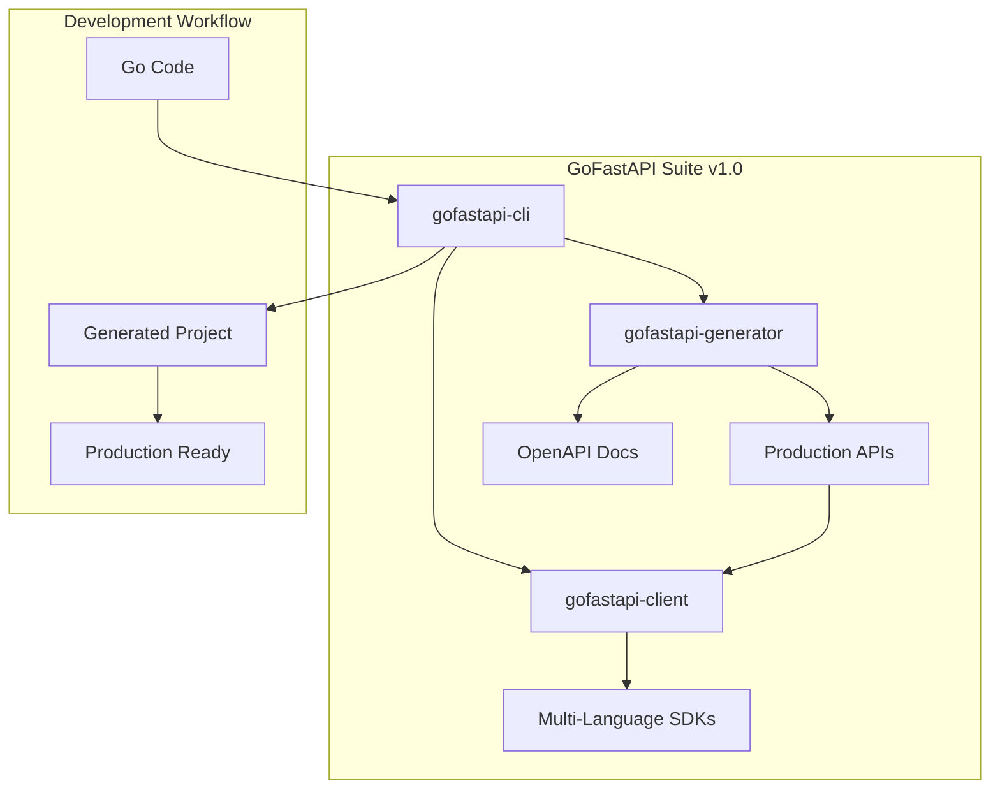

# GoFastAPI Suite - Implementation Roadmap & Technical Specifications

## Executive Summary

This document outlines the comprehensive implementation strategy for the GoFastAPI Suite, a revolutionary API development ecosystem that will transform how Go developers build, consume, and manage APIs. Our roadmap spans 5 years with clearly defined phases, technical requirements, and success metrics.

## Phase 0: Foundation (Current - Q1 2025)

### Current Status
- ✅ **GoFastAPI-Generator**: Smart method mapping implemented (187 routes generated)
- ✅ **Core Intelligence**: 25+ method patterns working
- ✅ **Multi-framework Architecture**: Template system ready
- ✅ **Production-ready**: JWT, CORS, validation patterns

### Immediate Tasks (0-3 months)

#### 1.0.1: Code Quality & Testing
```yaml
priority: HIGH
effort: 3 weeks
deliverables:
  - Comprehensive unit test suite (90% coverage)
  - Integration tests for all frameworks
  - Performance benchmarks
  - Security audit
  - Code documentation (godoc)
```

#### 1.0.2: Framework Expansion
```yaml
priority: HIGH
effort: 4 weeks
deliverables:
  - Echo framework generator
  - Chi framework generator
  - Fiber framework generator
  - Framework comparison benchmarks
  - Framework-specific optimization patterns
```

#### 1.0.3: CLI Interface
```yaml
priority: MEDIUM
effort: 3 weeks
deliverables:
  - Unified CLI interface
  - Configuration management
  - Project scaffolding
  - Batch processing capabilities
  - Plugin system foundation
```

## Phase 1: Product Suite Foundation (Q2-Q3 2025)

### 1.1: GoFastAPI Suite Unification

#### Technical Architecture


#### Repository Structure
```
gofastapi/
├── cmd/
│   ├── gofastapi/                    # Main CLI binary
│   ├── generator/                    # Generator CLI
│   └── client/                       # Client generation CLI
├── pkg/
│   ├── generator/                    # Core generator logic
│   │   ├── ast/                      # AST parsing
│   │   ├── mapping/                  # Smart method mapping
│   │   ├── templates/                # Template management
│   │   └── frameworks/               # Framework generators
│   ├── client/                       # Client generation
│   │   ├── codegen/                  # Code generation core
│   │   ├── languages/                # Language support
│   │   └── validation/               # Contract validation
│   ├── cli/                          # CLI logic
│   └── config/                       # Configuration management
├── internal/                         # Private packages
├── templates/                        # Code generation templates
├── examples/                         # Usage examples
├── docs/                            # Documentation
├── website/                         # Marketing website
└── scripts/                         # Build and deployment scripts
```

### 1.2: GoFastAPI-Client Development

#### Multi-Language Support Strategy
```yaml
languages:
  primary:
    - go: "Primary language, native Go client generation"
    - typescript: "Frontend integration, Node.js support"
    - python: "Data science, ML integration"
  secondary:
    - java: "Enterprise Android, backend systems"
    - csharp: ".NET ecosystem integration"
    - rust: "High-performance systems"

codegen_approach:
  - "Template-based generation with language-specific optimizations"
  - "Compile-time contract validation"
  - "Real-time synchronization with API changes"
```

#### Technical Implementation
```go
// Example: Client generation pipeline
type ClientGenerator struct {
    language    string
    apiSpec      *openapi3.Spec
    config       *GeneratorConfig
    templates    *template.Template
}

func (cg *ClientGenerator) GenerateClient() (*ClientPackage, error) {
    // 1. Parse OpenAPI specification
    // 2. Analyze endpoint patterns
    // 3. Generate type-safe models
    // 4. Generate client interface
    // 5. Generate HTTP transport layer
    // 6. Add error handling and retry logic
    // 7. Generate documentation and examples
}
```

### 1.3: GoFastAPI-CLI Enhancement

#### Command Structure
```bash
# Primary commands
gofastapi generate              # Generate APIs from Go code
gofastapi client               # Generate client libraries
gofastapi init                 # Initialize new project
gofastapi validate             # Validate API contracts
gofastapi deploy               # Deploy APIs

# Advanced commands
gofastapi migrate              # Migrate from other solutions
gofastapi benchmark            # Performance benchmarking
gofastapi audit                # Security audit
gofastapi docs                 # Generate documentation
```

#### Plugin System
```go
type Plugin interface {
    Name() string
    Version() string
    Execute(ctx context.Context, args []string) error
}

type PluginManager struct {
    plugins map[string]Plugin
    config  *PluginConfig
}

// Example plugin: Database integration
type DatabasePlugin struct{}

func (dp *DatabasePlugin) Execute(ctx context.Context, args []string) error {
    // Generate database models and migrations
    // Add database connection pooling
    // Implement repository patterns
}
```

## Phase 2: Advanced Features (Q4 2025 - Q1 2026)

### 2.1: AI-Powered Development

#### Integration with AI Models
```yaml
ai_features:
  code_analysis:
    - "Real-time AST analysis with AI suggestions"
    - "Performance optimization recommendations"
    - "Security vulnerability detection"
    - "Code quality assessment"

  api_design:
    - "Natural language to API generation"
    - "Intelligent endpoint grouping"
    - "Automatic documentation generation"
    - "Best practice recommendations"

  testing:
    - "Auto-generated integration tests"
    - "API contract testing"
    - "Load testing generation"
    - "Edge case identification"
```

#### MCP (Model Context Protocol) Server
```go
type GoFastAPIMCPServer struct {
    analyzer    *CodeAnalyzer
    suggester   *AISuggester
    validator   *ContractValidator
}

func (s *GoFastAPIMCPServer) HandleCodeSuggestion(ctx context.Context, req *CodeRequest) (*SuggestionResponse, error) {
    // 1. Analyze current code structure
    // 2. Identify optimization opportunities
    // 3. Generate AI-powered suggestions
    // 4. Provide implementation examples
    // 5. Include confidence scores
}
```

### 2.2: Advanced Security & Compliance

#### Enterprise Security Features
```yaml
security_features:
  authentication:
    - "JWT with refresh tokens"
    - "OAuth2 integration (Google, GitHub, Azure)"
    - "API key management"
    - "Multi-factor authentication"
    - "SAML/SSO integration"

  authorization:
    - "Role-based access control (RBAC)"
    - "Attribute-based access control (ABAC)"
    - "Resource-based permissions"
    - "Fine-grained policy management"

  protection:
    - "Input validation and sanitization"
    - "SQL injection prevention"
    - "XSS protection"
    - "CSRF protection"
    - "Rate limiting with Redis"
    - "DDoS protection"

  compliance:
    - "GDPR compliance tools"
    - "SOC2 Type II compliance"
    - "HIPAA compliance modules"
    - "PCI DSS compliance"
    - "Audit logging and monitoring"
```

### 2.3: Performance Optimization

#### Go-Specific Optimizations
```go
// Generated code performance patterns
func (h *Handler) GetUser(c *gin.Context) {
    // 1. Request validation with early returns
    id := c.Param("id")
    if !isValidUUID(id) {
        c.JSON(http.StatusBadRequest, gin.H{"error": "invalid ID"})
        return
    }

    // 2. Connection pooling for database operations
    user, err := h.userRepo.GetByID(id)
    if err != nil {
        c.JSON(http.StatusNotFound, gin.H{"error": "user not found"})
        return
    }

    // 3. Efficient JSON marshaling
    c.JSON(http.StatusOK, user)
}

// Performance optimizations
type PerformanceOptimizations struct {
    ConnectionPoolSize    int           `json:"connection_pool_size"`
    RequestTimeout       time.Duration `json:"request_timeout"`
    CacheStrategy        string        `json:"cache_strategy"`
    CompressionEnabled   bool          `json:"compression_enabled"`
    MetricsEnabled       bool          `json:"metrics_enabled"`
}
```

## Phase 3: Enterprise Features (Q2-Q3 2026)

### 3.1: Cloud-Native Integration

#### Kubernetes & Container Support
```yaml
kubernetes_features:
  deployment:
    - "Helm charts for all components"
    - "Kustomize overlays for environments"
    - "Deployment strategies (blue-green, canary)"
    - "Health checks and probes"
    - "Resource limits and requests"

  networking:
    - "Ingress controllers integration"
    - "Service mesh support (Istio, Linkerd)"
    - "Network policies"
    - "Load balancing configuration"
    - "TLS management"

  observability:
    - "Prometheus metrics integration"
    - "Grafana dashboards"
    - "OpenTelemetry tracing"
    - "Structured logging"
    - "Distributed tracing"

  storage:
    - "Persistent volume management"
    - "Database operators"
    - "Backup and recovery"
    - "Multi-region replication"
```

#### Cloud Provider Integration
```yaml
cloud_providers:
  aws:
    - "Lambda function generation"
    - "API Gateway integration"
    - "RDS database templates"
    - "S3 integration patterns"
    - "CloudWatch monitoring"

  gcp:
    - "Cloud Run deployment"
    - "Cloud Endpoints integration"
    - "Firestore templates"
    - "Cloud Storage integration"
    - "Stackdriver monitoring"

  azure:
    - "Azure Functions generation"
    - "API Management integration"
    - "Cosmos DB templates"
    - "Blob Storage integration"
    - "Application Insights"
```

### 3.2: Advanced Analytics & Monitoring

#### Real-Time Analytics Dashboard
```yaml
analytics_features:
  api_metrics:
    - "Request/response latency"
    - "Error rates and patterns"
    - "Endpoint usage statistics"
    - "Geographic distribution"
    - "User agent analysis"

  performance_metrics:
    - "Memory usage patterns"
    - "CPU utilization"
    - "Database query performance"
    - "Cache hit ratios"
    - "Garbage collection analysis"

  business_metrics:
    - "API adoption rates"
    - "Developer productivity"
    - "Cost optimization suggestions"
    - "ROI calculations"
    - "Usage forecasting"
```

#### Custom Analytics Engine
```go
type AnalyticsEngine struct {
    collector   *MetricsCollector
    processor   *DataProcessor
    storage     *TimeSeriesDB
    dashboard   *DashboardRenderer
}

func (ae *AnalyticsEngine) ProcessAPICall(call *APICall) error {
    // 1. Extract performance metrics
    // 2. Process business logic
    // 3. Store in time-series database
    // 4. Update real-time dashboards
    // 5. Trigger alerts if needed
}
```

## Phase 4: Ecosystem Dominance (Q4 2026 - Q2 2027)

### 4.1: Community & Open Source Foundation

#### Open Source Strategy
```yaml
community_approach:
  foundation:
    - "Establish GoFastAPI Foundation"
    - "Governance by community representatives"
    - "Transparent development process"
    - "Regular community calls and meetings"

  contribution:
    - "Comprehensive contributor guidelines"
    - "Automated testing and CI/CD"
    - "Code of conduct enforcement"
    - "Recognition programs"
    - "Bounty system for features"

  ecosystem:
    - "Third-party plugin marketplace"
    - "Template sharing platform"
    - "Community showcase"
    - "Certification programs"
    - "Training and education"
```

#### Plugin Marketplace
```yaml
marketplace_features:
  plugins:
    - "Database integrations (PostgreSQL, MySQL, MongoDB)"
    - "Authentication providers (Auth0, Okta, Keycloak)"
    - "Monitoring tools (Datadog, New Relic, Sentry)"
    - "Testing frameworks (Ginkgo, Testify)"
    - "Documentation generators (Swagger, Redoc)"
    - "Deployment tools (Terraform, Pulumi)"

  quality:
    - "Automated security scanning"
    - "Performance benchmarking"
    - "Compatibility testing"
    - "User reviews and ratings"
    - "Verified developer badges"
```

### 4.2: Advanced AI Integration

#### Next-Generation AI Features
```yaml
ai_roadmap:
  natural_language:
    - "API description to code generation"
    - "User stories to endpoint mapping"
    - "Business requirements to API design"
    - "Documentation auto-generation"

  predictive_analytics:
    - "API usage pattern prediction"
    - "Performance bottleneck forecasting"
    - "Security vulnerability prediction"
    - "Cost optimization suggestions"

  code_assistance:
    - "Intelligent refactoring suggestions"
    - "Performance optimization recommendations"
    - "Security vulnerability detection"
    - "Best practice enforcement"
```

#### AI-Powered Development Assistant
```go
type AIDevelopmentAssistant struct {
    llm         *LanguageModel
    context     *DevelopmentContext
    suggester   *CodeSuggester
    validator   *CodeValidator
}

func (ai *AIDevelopmentAssistant) SuggestOptimizations(code *GoCode) ([]*Optimization, error) {
    // 1. Analyze current code structure
    // 2. Identify performance bottlenecks
    // 3. Suggest Go-specific optimizations
    // 4. Generate optimized code
    // 5. Provide explanations and benchmarks
}
```

## Phase 5: Market Leadership (Q3-Q4 2027)

### 5.1: Industry Standardization

#### Standards Initiative
```yaml
standardization_goals:
  technical:
    - "Go API development standards"
    - "Best practices documentation"
    - "Performance benchmarks"
    - "Security guidelines"
    - "Interoperability standards"

  industry:
    - "Financial services compliance"
    - "Healthcare regulations (HIPAA)"
    - "Government standards (FISMA)"
    - "Educational standards"
    - "Enterprise governance"
```

#### Certification Programs
```yaml
certifications:
  developer:
    - "GoFastAPI Certified Developer"
    - "API Design Specialist"
    - "Security Implementation Expert"
    - "Performance Optimization Master"

  enterprise:
    - "GoFastAPI Certified Partner"
    - "Solution Provider Certification"
    - "Training Provider Accreditation"
    - "Consulting Partner Program"
```

### 5.2: Global Expansion

#### International Strategy
```yaml
global_expansion:
  localization:
    - "Multi-language documentation"
    - "Regional compliance modules"
    - "Local data center support"
    - "Currency and pricing localization"
    - "Cultural adaptation"

  partnerships:
    - "Regional cloud providers"
    - "Local consulting partners"
    - "Training and education partners"
    - "Technology alliances"
    - "Reseller programs"
```

## Technical Specifications

### Core Architecture Requirements

#### 1. Performance Requirements
```yaml
performance_targets:
  code_generation:
    - "< 5 seconds for typical applications"
    - "< 30 seconds for enterprise applications"
    - "< 1 second for incremental updates"
    - "Memory usage < 100MB during generation"

  runtime_performance:
    - "< 1ms additional latency vs hand-written"
    - "< 5% memory overhead"
    - "> 99.9% uptime"
    - "Support for 10K+ concurrent requests"

  scalability:
    - "Handle codebases up to 1M lines"
    - "Generate APIs with 10K+ endpoints"
    - "Support teams of 1000+ developers"
    - "Process 1000+ generations per hour"
```

#### 2. Security Requirements
```yaml
security_standards:
  code_generation:
    - "No security vulnerabilities in generated code"
    - "OWASP Top 10 compliance"
    - "Secure coding practices enforcement"
    - "Automated security scanning"

  runtime_security:
    - "JWT with RS256 support"
    - "OAuth 2.1 implementation"
    - "Rate limiting with Redis backend"
    - "SQL injection prevention"
    - "XSS and CSRF protection"
    - "Input validation and sanitization"

  compliance:
    - "GDPR compliance tools"
    - "SOC2 Type II ready"
    - "HIPAA compliance modules"
    - "PCI DSS compliance"
    - "Audit trail capabilities"
```

#### 3. Compatibility Requirements
```yaml
compatibility_matrix:
  go_versions:
    - "Go 1.19+ (current focus)"
    - "Go 1.18+ (extended support)"
    - "Future Go version compatibility"

  frameworks:
    primary:
      - "Gin v1.9+ (primary support)"
      - "Echo v4.0+ (full support)"
    secondary:
      - "Chi v5.0+ (full support)"
      - "Fiber v2.0+ (full support)"
    experimental:
      - "Gorilla Mux"
      - "HttpRouter"
      - "Custom frameworks"

  platforms:
    - "Linux (Ubuntu, CentOS, Alpine)"
    - "macOS (Intel, Apple Silicon)"
    - "Windows (WSL2, native)"
    - "Docker containers"
    - "Kubernetes clusters"
```

### Quality Assurance Requirements

#### Testing Strategy
```yaml
testing_approach:
  unit_testing:
    - "> 90% code coverage"
    - "Table-driven tests"
    - "Mock and stub support"
    - "Benchmark tests"

  integration_testing:
    - "Framework-specific integration tests"
    - "Database integration tests"
    - "API contract testing"
    - "End-to-end testing"

  performance_testing:
    - "Load testing (1000+ concurrent)"
    - "Stress testing (peak load scenarios)"
    - "Memory profiling"
    - "CPU usage analysis"

  security_testing:
    - "Static code analysis"
    - "Dynamic security scanning"
    - "Penetration testing"
    - "Vulnerability assessment"
```

#### Documentation Requirements
```yaml
documentation_standards:
  api_documentation:
    - "OpenAPI 3.0 specification"
    - "Interactive Swagger UI"
    - "Code examples in multiple languages"
    - "Error response documentation"

  developer_documentation:
    - "Getting started guides"
    - "Advanced configuration"
    - "Troubleshooting guides"
    - "Best practices documentation"

  architecture_documentation:
    - "System design documents"
    - "API architecture patterns"
    - "Security architecture"
    - "Performance optimization guides"
```

## Success Metrics & KPIs

### Technical Metrics
```yaml
technical_kpis:
  code_quality:
    - "Generated code compilation success: 100%"
    - "Security vulnerabilities in generated code: 0%"
    - "Performance overhead: < 5% vs hand-written"
    - "Memory usage increase: < 5% vs hand-written"

  developer_experience:
    - "Setup time: < 5 minutes"
    - "Learning curve: < 30 minutes to mastery"
    - "Error rate: < 1% of generated code"
    - "Satisfaction score: > 4.5/5"

  performance:
    - "Generation time: < 5 seconds"
    - "Support for 10K+ endpoints"
    - "Sub-millisecond latency overhead"
    - "99.9% uptime guarantee"
```

### Business Metrics
```yaml
business_kpis:
  adoption:
    - "10K+ active developers (Year 1)"
    - "500+ enterprise customers (Year 2)"
    - "50K+ GitHub stars (Year 1)"
    - "100K+ APIs generated (Year 1)"

  revenue:
    - "$1M ARR (Year 2)"
    - "$10M ARR (Year 4)"
    - "80% gross margin"
    - "90% customer retention"

  market_position:
    - "#1 Go API development tool (Year 2)"
    - "50%+ market share (Year 3)"
    - "Industry standard recognition (Year 4)"
    - "Acquisition interest from major tech companies (Year 5)"
```

## Risk Mitigation Strategy

### Technical Risks
```yaml
technical_risks:
  go_version_changes:
    risk: "Future Go versions may break compatibility"
    mitigation: "Automated testing across Go versions, version detection"
    probability: "Medium"
    impact: "High"

  framework_evolution:
    risk: "Framework changes may require updates"
    mitigation: "Plugin architecture, community contributions"
    probability: "Medium"
    impact: "Medium"

  performance_regulations:
    risk: "Generated code may have performance issues"
    mitigation: "Continuous benchmarking, optimization patterns"
    probability: "Low"
    impact: "High"
```

### Business Risks
```yaml
business_risks:
  competition:
    risk: "Large companies may build competing tools"
    mitigation: "First-mover advantage, community building, patent protection"
    probability: "High"
    impact: "Medium"

  market_acceptance:
    risk: "Developers may resist automated generation"
    mitigation: "Free tier, extensive documentation, community engagement"
    probability: "Low"
    impact: "High"

  scaling_challenges:
    risk: "Rapid growth may strain resources"
    mitigation: "Cloud-native architecture, automated processes"
    probability: "Medium"
    impact: "High"
```

## Conclusion

This comprehensive implementation roadmap positions GoFastAPI Suite as the undisputed leader in Go API development. With:

1. **Technical Excellence**: AI-powered intelligence, Go-native optimization, enterprise-grade security
2. **Market Dominance**: First-mover advantage, community leadership, industry standardization
3. **Developer Experience**: Zero-curve adoption, delightful workflows, comprehensive support
4. **Business Success**: Clear monetization strategy, enterprise adoption, global expansion

The GoFastAPI Suite will revolutionize API development and establish itself as the industry standard for Go developers worldwide.

---

**Next Steps**: Begin Phase 0 implementation with immediate focus on testing, framework expansion, and CLI interface development.