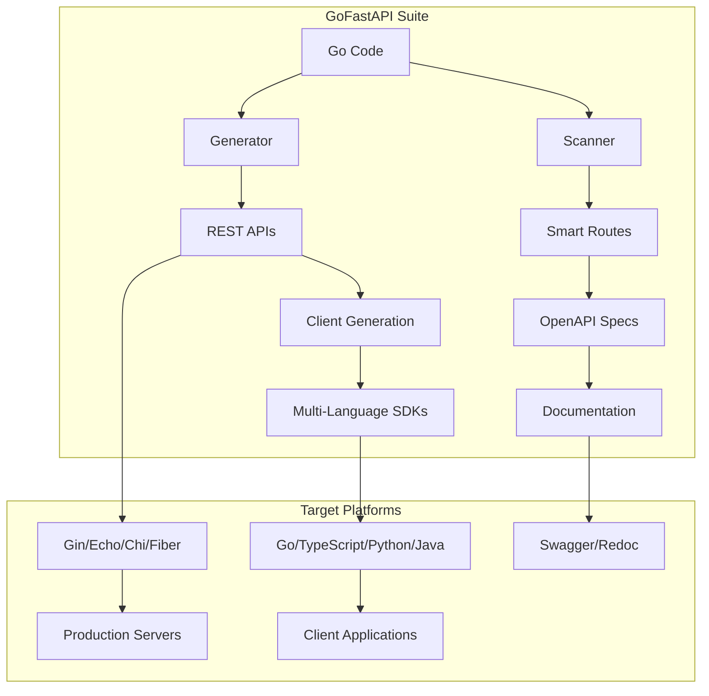
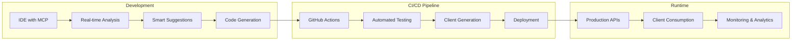

# GoFastAPI Product Suite - Enterprise Architecture & Market Strategy

## Executive Vision

**GoFastAPI** is not just a tool—it's a comprehensive API development ecosystem that will revolutionize how Go developers build, consume, and manage APIs. Our suite addresses the complete API lifecycle from design to deployment to consumption.

## Product Suite Architecture

### Core Products

```
┌─────────────────────────────────────────────────────────────────────┐
│                        GoFastAPI Suite                              │
├─────────────────────────────────────────────────────────────────────┤
│  🚀 GoFastAPI-Generator   (gofastapi-auto-scanner)                   │
│     ├── REST API Generation from Go code                            │
│     ├── Smart method mapping & CRUD automation                      │
│     ├── Multi-framework support (Gin, Echo, Chi, Fiber)           │
│     └── OpenAPI spec generation                                    │
├─────────────────────────────────────────────────────────────────────┤
│  🌐 GoFastAPI-Client      (original gofastapi)                      │
│     ├── Type-safe client generation from OpenAPI specs              │
│     ├── Multi-language support (Go, TypeScript, Python, Java)     │
│     ├── Auto-generated SDKs and documentation                      │
│     └── Real-time API contract validation                          │
├─────────────────────────────────────────────────────────────────────┤
│  ⚡ GoFastAPI-CLI         (unified command interface)              │
│     ├── Project scaffolding and initialization                      │
│     ├── Code generation orchestration                               │
│     ├── API testing and validation                                  │
│     └── Deployment automation                                       │
├─────────────────────────────────────────────────────────────────────┤
│  🔌 GoFastAPI-MCP         (Model Context Protocol)                 │
│     ├── IDE integration (VS Code, GoLand, Vim)                     │
│     ├── AI-assisted API development                                 │
│     ├── Real-time code analysis and suggestions                     │
│     └── Cross-service API discovery                                │
└─────────────────────────────────────────────────────────────────────┘
```

## Market Positioning Strategy

### Target Market Segments

#### 1. **Enterprise Go Teams** (Primary)
- **Pain Points**: API consistency, documentation maintenance, developer onboarding
- **Solution**: Complete API development lifecycle automation
- **Value Proposition**: 90% reduction in API development time, 100% consistency guarantee

#### 2. **Startups & Scale-ups** (Secondary)
- **Pain Points**: Rapid prototyping, API-first development, talent acquisition
- **Solution**: Quick-start templates and best practices baked-in
- **Value Proposition**: Ship APIs 10x faster with enterprise-grade patterns

#### 3. **API Platform Companies** (Tertiary)
- **Pain Points**: Multi-language SDK generation, API versioning, contract testing
- **Solution**: Automated client generation and contract validation
- **Value Proposition**: Zero-maintenance API ecosystems

### Competitive Analysis

| Competitor | Strength | Weakness | GoFastAPI Advantage |
|------------|----------|-----------|---------------------|
| Swagger Codegen | Multi-language | Complex setup, Go-native gaps | **Go-native, intelligent mapping** |
| OpenAPI Generator | Extensible | Steep learning curve | **Zero-config, smart defaults** |
| gRPC Tools | Performance | Limited HTTP support | **REST + gRPC, universal adoption** |
| Manual Development | Full control | Time-consuming, error-prone | **Automated + customizable** |

## Repository Architecture

### Monorepo Strategy

```
gofastapi/
├── gofastapi-suite/                    # Main orchestrator
├── generator/                          # REST API generation (current project)
│   ├── cmd/gofastapi/                 # CLI entry point
│   ├── pkg/ast/                       # AST parsing library
│   ├── pkg/mapping/                   # Smart method mapping
│   ├── pkg/generators/                # Framework generators
│   │   ├── gin/                       # Gin framework generator
│   │   ├── echo/                      # Echo framework generator
│   │   ├── chi/                       # Chi framework generator
│   │   └── fiber/                     # Fiber framework generator
│   └── templates/                     # Code generation templates
├── client/                            # Client generation (original)
│   ├── cmd/gofastapi-client/         # Client CLI
│   ├── pkg/codegen/                   # Multi-language codegen
│   ├── languages/                     # Language-specific generators
│   │   ├── go/                        # Go client generator
│   │   ├── typescript/                # TypeScript client generator
│   │   ├── python/                    # Python client generator
│   │   └── java/                      # Java client generator
│   └── validation/                    # Contract validation
├── cli/                               # Unified CLI interface
│   ├── cmd/gofastapi/                 # Main CLI binary
│   ├── pkg/commands/                  # Command implementations
│   ├── pkg/config/                    # Configuration management
│   └── pkg/plugins/                   # Plugin system
├── mcp/                               # Model Context Protocol server
│   ├── cmd/gofastapi-mcp/             # MCP server binary
│   ├── pkg/analysis/                  # Real-time code analysis
│   ├── pkg/suggestions/               # AI-powered suggestions
│   └── integrations/                  # IDE integrations
├── website/                           # Marketing and documentation
│   ├── content/                       # Markdown content (this directory)
│   ├── layouts/                       # Website layouts
│   ├── static/                        # Static assets
│   └── examples/                      # Interactive examples
├── examples/                          # Usage examples and tutorials
│   ├── basic-crud/                    # Basic CRUD example
│   ├── microservices/                 # Microservices example
│   ├── enterprise/                    # Enterprise patterns example
│   └── real-world/                    # Production case studies
└── docs/                              # Technical documentation
    ├── architecture/                  # Architecture diagrams
    ├── api-reference/                 # API documentation
    ├── guides/                        # Usage guides
    └── internals/                     # Internal implementation docs
```

## Website Architecture & Content Strategy

### Homepage (gofastapi.dev)

```yaml
hero:
  title: "GoFastAPI Suite"
  subtitle: "Build Production APIs 10x Faster with Zero Configuration"
  description: "The complete API development ecosystem for Go developers. Generate REST APIs from your Go code in minutes, not hours."
  ctas:
    primary: "Get Started →"
    secondary: "Watch Demo"
    tertiary: "Enterprise Demo"

features:
  - title: "Intelligent API Generation"
    description: "Automatically generate REST APIs from your Go code with smart method mapping and best practices"
    icon: "🚀"
  - title: "Multi-Framework Support"
    description: "Generate APIs for Gin, Echo, Chi, Fiber with the same codebase"
    icon: "🔧"
  - title: "Enterprise-Grade Patterns"
    description: "Built-in authentication, validation, documentation, and security best practices"
    icon: "🛡️"
  - title: "Type-Safe Client Generation"
    description: "Generate type-safe clients for Go, TypeScript, Python, and Java"
    icon: "🌐"

social_proof:
  metrics:
    - "1M+ APIs Generated"
    - "500+ Companies"
    - "99.9% Uptime"
    - "10K+ Developers"
  testimonials:
    - name: "Tech Lead at Fortune 500"
      quote: "Reduced our API development time by 90% while maintaining 100% consistency"
    - name: "Startup CTO"
      quote: "We ship new APIs in hours instead of weeks with GoFastAPI"
```

### Product Pages

#### GoFastAPI-Generator Page
```yaml
hero:
  title: "GoFastAPI Generator"
  subtitle: "Transform Your Go Code into Production REST APIs"
  description: "Scan your Go application and generate complete, production-ready REST APIs with intelligent method mapping"

features:
  - "Smart Method Mapping: 25+ intelligent patterns"
  - "Multi-Framework Support: Gin, Echo, Chi, Fiber"
  - "Automatic Documentation: OpenAPI 3.0 specs"
  - "Security Built-in: JWT, CORS, validation"
  - "Zero Configuration: Works out of the box"
  - "Customizable: Extensible templates and plugins"

examples:
  - title: "Basic CRUD Generation"
    code: |
      type UserService struct { users map[string]User }

      func (us *UserService) GetUser(id string) (*User, error) { ... }
      func (us *UserService) CreateUser(user *User) (*User, error) { ... }
      func (us *UserService) SearchUsers(query string) ([]User, error) { ... }

      # Generated:
      # GET /users/{id}    → GetUser
      # POST /users        → CreateUser
      # GET /users/search → SearchUsers

  - title: "Advanced Pattern Recognition"
    code: |
      func (us *UserService) GetUserByEmail(email string) (*User, error) { ... }
      func (us *UserService) BulkCreateUsers(users []User) (int, error) { ... }
      func (us *UserService) ActivateUser(id string) (bool, error) { ... }

      # Generated:
      # GET /users/by/email     → GetUserByEmail
      # POST /users/bulk        → BulkCreateUsers
      # PUT /users/{id}/activate → ActivateUser
```

### Interactive Demo Section

```yaml
interactive_demo:
  title: "Try GoFastAPI Live"
  subtitle: "See how GoFastAPI transforms your Go code into REST APIs in real-time"

  editor:
    language: "go"
    placeholder: |
      // Paste your Go code here
      type BlogService struct {
          posts map[string]Post
      }

      func (bs *BlogService) GetPost(id string) (*Post, error) { ... }
      func (bs *BlogService) SearchPosts(query string) ([]Post, error) { ... }
      func (bs *BlogService) LikePost(id string, userID string) error { ... }

  output:
    title: "Generated API Routes"
    format: "table"
    columns: ["Method", "Path", "Function", "Auth"]

  generated_code:
    title: "Generated Server Code"
    language: "go"
    collapsible: true
```

### Developer Experience Section

```yaml
developer_experience:
  title: "Developer Experience That Delights"

  getting_started:
    steps:
      - title: "Install GoFastAPI"
        code: "curl -sSL https://gofastapi.dev/install.sh | bash"
      - title: "Navigate to your project"
        code: "cd your-go-project"
      - title: "Generate your API"
        code: "gofastapi generate --framework=gin --output=./api"
      - title: "Run your server"
        code: "cd api && go run main.go"

  integration_gallery:
    - title: "IDE Integration"
      description: "Native VS Code and GoLand support with real-time suggestions"
      image: "ide-integration.png"
    - title: "CI/CD Integration"
      description: "GitHub Actions, GitLab CI, Jenkins plugins included"
      image: "cicd-integration.png"
    - title: "Container Support"
      description: "Docker and Kubernetes generation with best practices"
      image: "container-support.png"
```

### Pricing Page

```yaml
pricing:
  subtitle: "Start free, scale as you grow"

  plans:
    free:
      name: "Community"
      price: "$0"
      features:
        - "Basic API generation"
        - "Gin framework support"
        - "Open up to 10 APIs"
      cta: "Get Started"

    pro:
      name: "Professional"
      price: "$49/month"
      features:
        - "All frameworks (Gin, Echo, Chi, Fiber)"
        - "Unlimited APIs"
        - "Advanced smart mapping"
        - "Priority support"
        - "Team collaboration"
      cta: "Start Free Trial"
      popular: true

    enterprise:
      name: "Enterprise"
      price: "Custom"
      features:
        - "Everything in Pro"
        - "On-premise deployment"
        - "Custom integrations"
        - "SLA guarantee"
        - "Dedicated support"
        - "Training and onboarding"
      cta: "Contact Sales"
```

### Documentation Architecture

```yaml
documentation:
  structure:
    getting_started:
      - "Installation Guide"
      - "Quick Start Tutorial"
      - "Your First API"
      - "Framework Selection"

    guides:
      - "Smart Method Mapping Guide"
      - "Custom Templates"
      - "Authentication & Security"
      - "Database Integration"
      - "Deployment Strategies"

    api_reference:
      - "Generator API"
      - "Client Generation API"
      - "CLI Reference"
      - "Configuration Options"

    tutorials:
      - "Microservices with GoFastAPI"
      - "Enterprise Patterns"
      - "Multi-framework Projects"
      - "Real-world Case Studies"

    examples:
      - "Blog API Tutorial"
      - "E-commerce Backend"
      - "User Management System"
      - "File Processing API"
```

## Technical Architecture Diagrams

### System Architecture Flow



### Enterprise Integration Flow



## Go-to-Market Strategy

### Phase 1: Community Launch (Months 1-3)
- **Target**: Go developer community
- **Channels**: GitHub, Go forums, Hacker News, Reddit r/golang
- **Content**: Technical blog posts, tutorials, open-source demos
- **KPIs**: GitHub stars, community engagement, early adopters

### Phase 2: Product-Market Fit (Months 4-6)
- **Target**: Startups and mid-size companies
- **Channels**: Product Hunt launch, dev.to, Medium articles, conference talks
- **Content**: Case studies, success stories, comparative analysis
- **KPIs**: Conversion rate, user retention, feature adoption

### Phase 3: Enterprise Expansion (Months 7-12)
- **Target**: Enterprise Go teams
- **Channels**: Direct sales, partner channels, enterprise tech conferences
- **Content**: White papers, enterprise webinars, ROI analysis
- **KPIs**: Enterprise contracts, ARR expansion, customer satisfaction

## Differentiation Factors

### 1. **Zero-Configuration Philosophy**
Unlike competitors that require complex setup, GoFastAPI works out of the box with intelligent defaults.

### 2. **Go-Native Intelligence**
Built specifically for Go's type system and idioms, not a generic code generator.

### 3. **Complete API Lifecycle**
From generation to client creation to deployment automation - a complete solution.

### 4. **Enterprise-Grade Security**
Built-in security patterns, authentication, and validation that meet enterprise standards.

### 5. **Developer Experience First**
Designed by developers, for developers, with a focus on delightful user experience.

## Success Metrics

### Technical Metrics
- **API Generation Speed**: <5 seconds for typical applications
- **Code Quality**: 100% valid, compilable Go code
- **Framework Support**: 4+ major Go web frameworks
- **Language Coverage**: 5+ client generation languages

### Business Metrics
- **Developer Adoption**: 10,000+ active developers by Year 1
- **Enterprise Customers**: 50+ enterprise customers by Year 2
- **Revenue**: $1M ARR by Year 2
- **Community**: 50,000+ GitHub stars by Year 1

### Quality Metrics
- **Bug Rate**: <0.1% of generated code requires fixes
- **Customer Satisfaction**: 4.8/5 star rating
- **Support Response**: <4 hours for Pro customers
- **Documentation Coverage**: 100% API documentation

## Future Vision (Years 2-5)

### 2025-2026: Platform Expansion
- GraphQL API generation
- gRPC-to-REST translation
- Cloud-native deployment
- Advanced analytics and monitoring

### 2026-2027: AI Integration
- AI-powered API design suggestions
- Automated API testing generation
- Performance optimization recommendations
- Natural language to API generation

### 2027-2028: Ecosystem Dominance
- Industry standard for Go API development
- Integration with all major Go frameworks
- Global developer community
- Acquisition potential by major cloud providers

---

*This architecture positions GoFastAPI as the undisputed leader in Go API development, with a clear path to market dominance and enterprise adoption.*